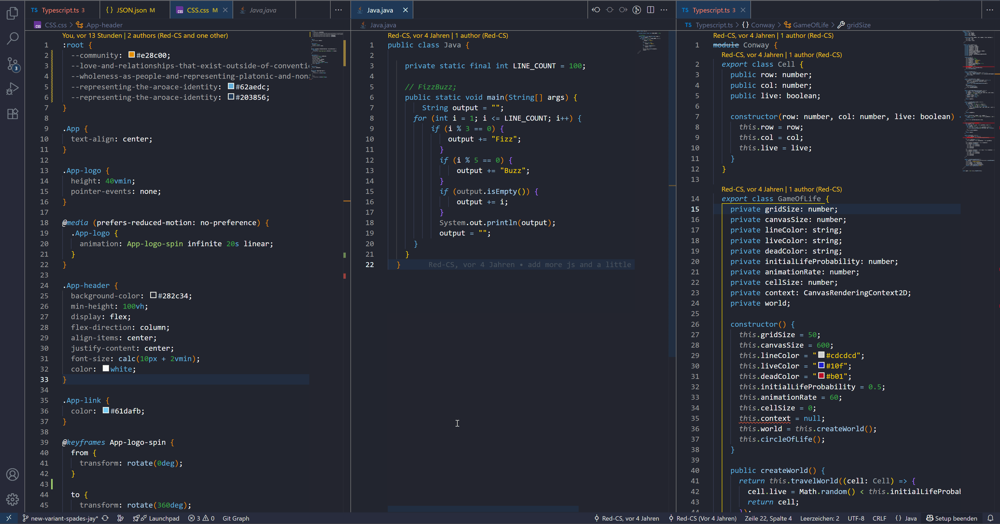

</img>

<h1 align="center"><i>Aro Ace Theme</i></h1>

A dark Aro-Ace Styled VS Code Theme

Also includes a Light variant: "Aro Ace Light"

</img>

## About

_Aro Ace_ is an Aromantic Asexual Styled VS Code Theme developed and designed to you by an Aromantic Asexual. This theme is inspired by the the [Spades](https://github.com/redpwilliams/Spades) theme from [redpwilliams](https://github.com/redpwilliams) which is in return inspired by the Microsoft Palenight theme.

## Supported Languages

- Javascript (.js, .jsx)
- Typescript (.ts, .tsx)
- HTML
- CSS
- JSON
- Java

**Have fun with this one 🧡💛🤍🩵💙**